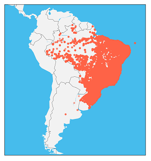

# E-Commerce Analysis - EDA

In this kernel, I would like to show some descriptive analysis of 'Olist Store' from Brazil. This data contains 100k orders information between 2016-2018.

Above analysis made by orders, geolocation, payments, seller, and products datasets. The aim of this project is finding the Top 10 products and sellers, analysis of orders by their geolocation and obtain information about Brazilian's online e-commerce profiles.

## Visualizition Analysis

*Above map shows the location of purchased product orders and according to the distribution of populations, it explains the highest shopping rate on the east coast.*

*The above graph shows the number of product orders purchased based on the states. According to that, São Paulo has the highest rate and there is a huge gap between the rest of the states.*

*Above graph shows that the earliest and latest deliveries. According to that, we can say that all deliveries made before their estimated date.*

* The earliest deliveries have been made in October. It means that this month is the least intensive period in those years.